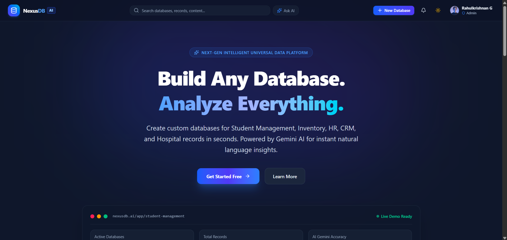
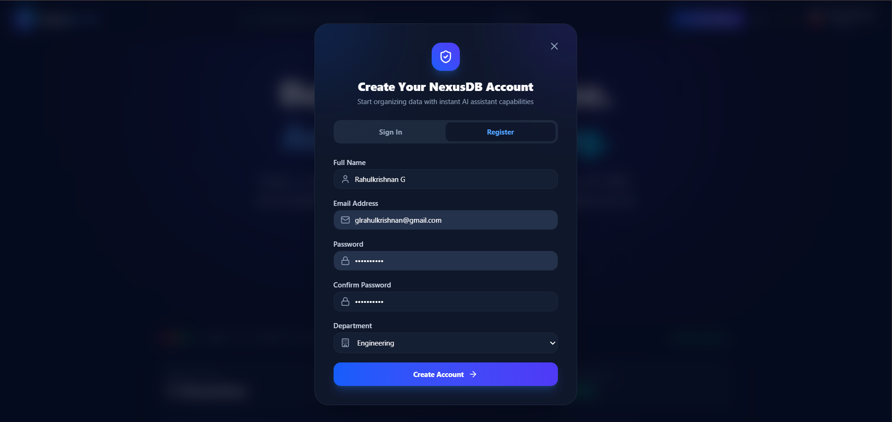
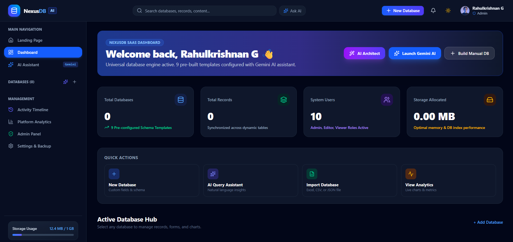
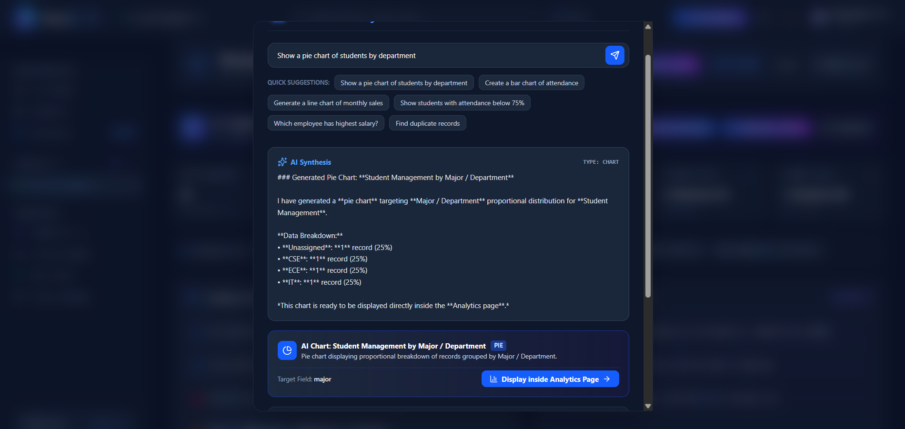
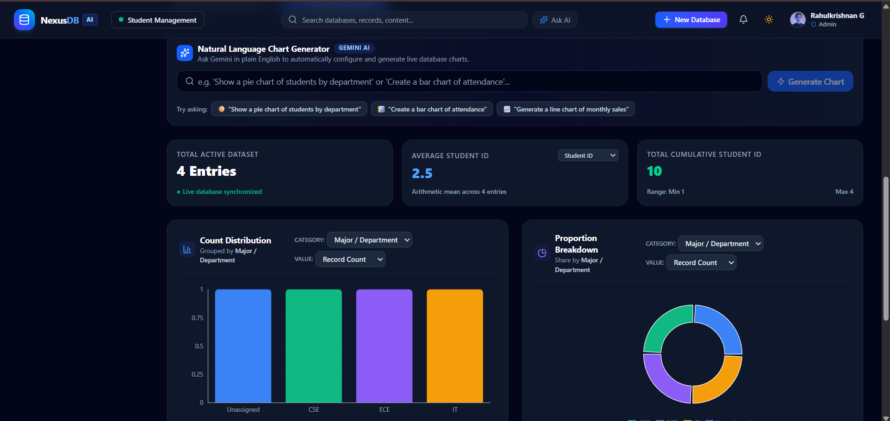
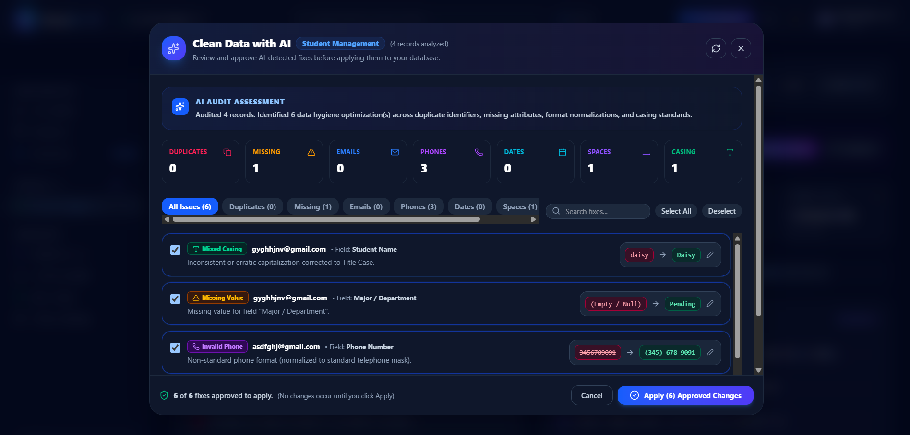
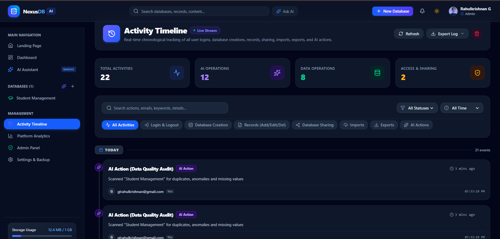

# NexusDB AI 🚀

### AI-Powered Universal Database Management Platform

NexusDB AI is a modern, AI-powered database management platform designed to simplify database creation, record management, data analysis, and intelligent insights through a unified interface.

Built with React, TypeScript, Node.js, MongoDB, and Google Gemini AI, NexusDB AI combines traditional database operations with natural-language AI capabilities.

---

## ✨ Overview

NexusDB AI provides a centralized workspace for creating and managing databases, organizing records, analyzing information, and improving data quality with AI-assisted tools.

The platform supports a wide range of use cases, including student management, inventory management, HR, CRM, and other structured data applications.

### Why NexusDB AI?

* Create custom databases without complex database configuration.
* Manage records through an interactive dashboard.
* Ask questions about your data using natural language.
* Generate charts, reports, and analytical insights.
* Detect and review potential data quality issues.
* Manage users and database access through authentication and sharing features.

---

## 📸 Application Preview

### 1. Landing Page

The NexusDB AI landing page introduces the platform and its core capabilities.



### 2. User Registration

Users can create an account and access the database management platform.



### 3. Dashboard

The main dashboard provides an overview of databases, records, users, storage, and quick actions.



### 4. Custom Database Creation

Create a database by defining its name, category, description, and custom schema fields.


### 5. Database Management

Manage database records, schemas, and database-specific operations through a dedicated workspace.


### 6. AI Assistant

Interact with your data using natural-language queries powered by Google Gemini AI.



### 7. Database Analytics

Explore data distributions, statistics, charts, and analytical insights.



### 8. AI Data Cleaning

Review AI-detected data quality issues and approve suggested corrections before applying changes.



### 9. Activity Timeline

Track database operations, AI actions, authentication events, and other platform activities.



---

## 🚀 Key Features

### 🔐 Authentication & User Management

* User registration and login.
* Role-based access concepts.
* User profiles and account management.
* Secure password handling.

### 🗄️ Dynamic Database Creation

* Create custom databases with flexible schemas.
* Define fields and data types.
* Support database categories such as education, inventory, and CRM.
* Manage multiple databases from a centralized dashboard.

### ✏️ Database Operations

* Create, view, edit, and delete records.
* Manage database schemas.
* Search databases and records.
* Import and export data.

### 🤖 AI-Powered Database Assistant

* Ask questions about database records using natural language.
* Generate analytical insights.
* Request charts based on database information.
* Generate AI-assisted reports.

### 🧹 Intelligent Data Cleaning

* Detect missing values.
* Identify potential formatting issues.
* Review suggested corrections.
* Approve changes before applying them to the database.

### 📊 Analytics & Visualization

* View record counts and summary statistics.
* Analyze category distributions.
* Explore database metrics through charts.
* Generate insights from structured data.

### 👥 Database Sharing

* Share databases with other users.
* Support collaborative database access.
* Manage access through the platform's sharing features.

### 🛡️ Administration & Activity Tracking

* Admin dashboard.
* Activity timeline.
* Authentication and database activity tracking.
* Monitoring of AI and data operations.

---

## 🛠️ Tech Stack

| Technology       | Purpose                                 |
| ---------------- | --------------------------------------- |
| React            | Frontend user interface                 |
| TypeScript       | Type-safe application development       |
| Vite             | Frontend development and build tooling  |
| Node.js          | Backend runtime                         |
| Express          | Backend API framework                   |
| MongoDB          | Database storage                        |
| Google Gemini AI | AI-powered analysis and assistance      |
| CSS              | Interface styling and responsive design |

---

## 🏗️ Project Structure

```text
NexusDB-AI/
│
├── public/
├── src/
├── server/
├── data/
├── screenshots/
│
├── .env.example
├── package.json
├── package-lock.json
├── server.ts
├── vite.config.ts
└── README.md
```

---

## ⚙️ Installation & Setup

### 1. Clone the Repository

```bash
git clone https://github.com/rkzzzz008/NexusDB-AI.git
```

### 2. Navigate to the Project

```bash
cd NexusDB-AI
```

### 3. Install Dependencies

```bash
npm install
```

### 4. Configure Environment Variables

Create a `.env.local` file in the project root and add the required configuration.

```env
GEMINI_API_KEY=your_gemini_api_key
MONGODB_URI=your_mongodb_connection_string
JWT_SECRET=your_secure_secret
```

**Important:** Never commit real API keys, database credentials, or private secrets to GitHub. Use `.env.example` to document required variables.

### 5. Start the Development Server

```bash
npm run dev
```

If you are using Windows PowerShell and encounter an npm execution-policy issue, you can run:

```bash
npm.cmd run dev
```

The application will be available at the local address displayed in your terminal.

---

## 🔑 Environment Variables

| Variable         | Description                                   |
| ---------------- | --------------------------------------------- |
| `GEMINI_API_KEY` | Google Gemini API key for AI features         |
| `MONGODB_URI`    | MongoDB connection string                     |
| `JWT_SECRET`     | Secret used for authentication token handling |

---

## 📌 Use Cases

NexusDB AI can be adapted for:

* Student Management Systems.
* Inventory and product tracking.
* Human Resource Management.
* Customer Relationship Management.
* Hospital and record management.
* Custom business data applications.

---

## 🔮 Future Improvements

Potential future enhancements include:

* Advanced database collaboration.
* More AI-powered data analysis.
* Improved import and export support.
* Additional visualization options.
* Enhanced permission management.
* Cloud deployment and production optimization.

---

## 👨‍💻 Author

**Rahulkrishnan G**

B.Tech Information Technology Student

### Connect With Me

* GitHub: [rkzzzz008](https://github.com/rkzzzz008)
* Project Repository: [NexusDB AI](https://github.com/rkzzzz008/NexusDB-AI)

---

## ⭐ Support

If you find NexusDB AI interesting, consider giving the repository a star ⭐ on GitHub!

Rahulkrishnan G
